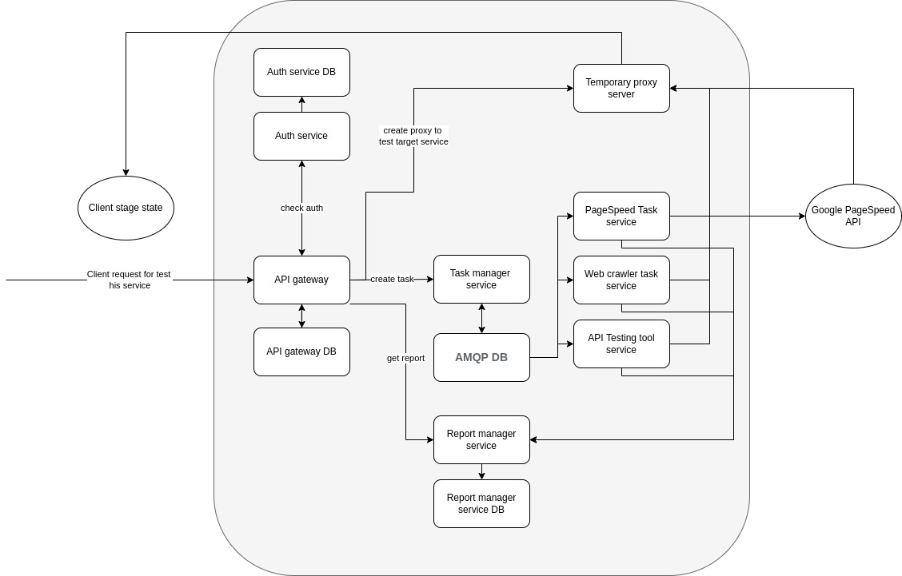

## Overview 

**This is boilerplate project. Code may contain bugs and vulnerabilities. Not recommended for use in a production stage.**

**This is alpha version, someone features/services may not work correctly. Please check [todo-list](https://github.com/tsiplenkov/dqm#what-should-be-done)

Deployment quality monitoring - selfhost-based service for improve deploy quality web-services.

> This project use [git submodule](https://git-scm.com/docs/git-submodule) for join all services in single repo. For clone all services run:
```shell
git clone https://github.com/tsiplenkov/dqm
cd dqm
git submodule init
git submodule update
```

### Structure



* Api Gateway ([Kong](https://konghq.com/kong/)) with DB (Postgres)
* Auth service (Django-restframework) with DB (Postgres)
* Task manager service (FastApi + celery) with MQ DB (Redis) and with monitoring (celery flover)
    * Task PageSpeed service (Celery + httpx)
    * Task crawler service 
    * Task API Test service (Celery + schemathesis)
* Temporary proxy server (Nginx)
* Report Manager service (FastApi) with DB (MongoDB)

### How it work

1. User registered and auth on **auth service**
2. User create task for testing his service (for example PageSpeed test)
    1. **Task manager service** create request for testing to MQ DB
    2. (Optionaly) Create **temporary proxy server** to client stage 
    3. **PageSpeed worker** get task from AMQP DB and create request to Google PageSpeed API for testing
    4. **PageSpeed wokrer** get response from Google PageSpeed API and send report to **Report manager service**
3. User request a report from "Report manager service"

### What should be done

* Api Gateway
    * Proxy as subdomain
    * Proxy as url path
* Auth service
    * Fix swagger docs view with proxy path Api gateway
    * Integrate auth to Kong Api gateway
* ~~Task manager~~
    * ~~Create task~~
    * ~~Get task status~~
* PageSpeed task worker
    * ~~Send request to Google PageSpeed API~~
    * Check Exeption
* Web Crawler task worker
    * Check non-200 status code
* Api testing task worker
* Proxy service
* Report manager service
    * ~~Create and get Pagespeed Report~~